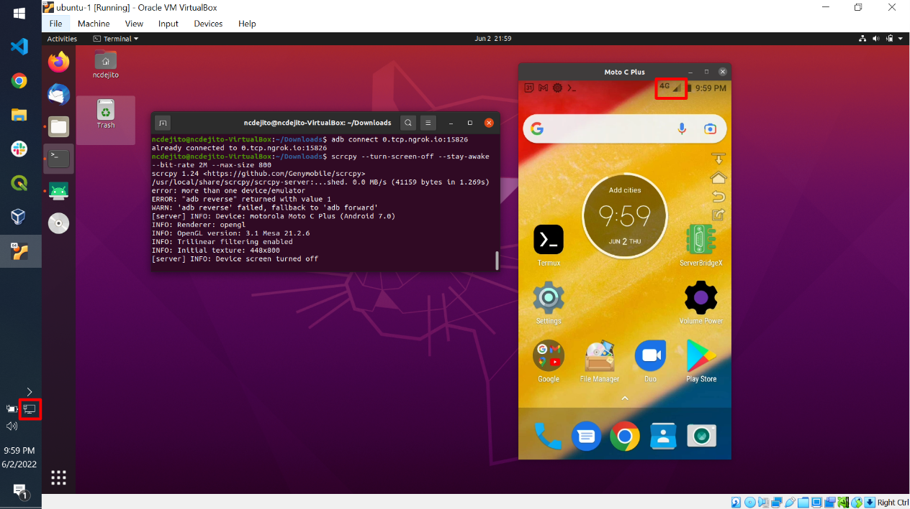

# scrcpy-ngrok
Display and control Android over 4G network

## Requirements
1. [Scrcpy](https://github.com/Genymobile/scrcpy)
1. [NGrok](https://ngrok.com/docs/getting-started)
1. [ADB](https://developer.android.com/studio/command-line/adb)
1. [Termux (F-Droid version)](https://f-droid.org/en/packages/com.termux/)

Tested on Android 7.0

## Setup
Follow instructions in `run.sh`.

## References
* [Using ngrok (to access a remote Firestick 4K)](https://flakie.co.uk/using-ngrok/)
